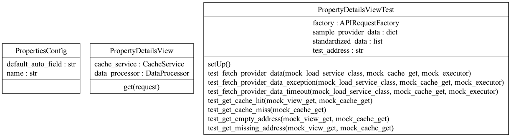
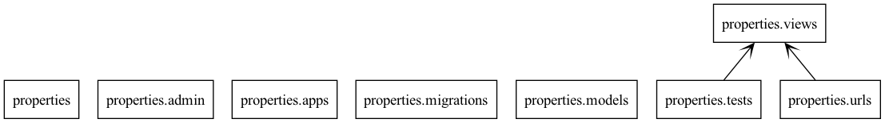

# 🚀 Technical Test Hometap - Johann Cepeda

## 📋 Description

This project is a simple full-stack application built with Python using Django as the backend framework and React as the frontend library for creating intuitive and visually appealing user interfaces.

The main goal of the application is to display a table with results from two different providers. Each provider returns a JSON response with its own structure, so the application processes and normalizes the data into a unified format before delivering it to the frontend via an HTTP request.

The application exposes a single endpoint using the GET method to retrieve the processed data.


[](LICENSE)

## ✨ Key Features

- ✅ Concurrent data fetching from multiple property data providers
- ✅ Intelligent 24-hour caching system for improved performance
- ✅ Advanced JSON data normalization with configurable mapping
- ✅ RESTful API with address-based property lookups
- ✅ Comprehensive logging for monitoring and debugging
- ✅ Thread-pooled execution with configurable timeouts
- ✅ Robust error handling and validation pipeline

## 🛠️ Technologies Used

### 🔹 Backend

- [Python](https://www.python.org/) - Main programming language
- [Django](https://www.djangoproject.com/) - Web framework
- [Django REST Framework](https://www.django-rest-framework.org/) - RESTful API
- [Redis](https://redis.io/) - In-memory data structure store used for caching
- [Poetry](https://python-poetry.org/) - Dependency management

### 🔹 Frontend

- [React](https://reactjs.org/) - JavaScript library
- [TypeScript](https://www.typescriptlang.org/) - Typed JavaScript
- [Tailwind CSS](https://tailwindcss.com/) - Utility-first CSS framework
- [Lucide](https://lucide.dev/) - Icon toolkit
- [React-Toastify](https://fkhadra.github.io/react-toastify/) - Toast notifications
- [Yarn](https://yarnpkg.com/) - Package manager

## 🎥 Demo

<div align="center">
<video width="600" controls>
    <source src="https://github.com/johanncepeda9816/hometap-technical-test/blob/main/assets/demo.gif" type="video/mp4">
    Your browser does not support the video tag.
</video>
</div>

## 📊 Diagrams

### Classes



### Packages



## 🚀 Installation

### Prerequisites

- Python 3.9+
- Node.js 16+
- Redis (optional, for caching)

### Backend Setup

```bash
#Clone repository
This repository

# Install dependencies
cd backend
cp .env.example .env
poetry install

# Activate virtual environment
poetry env activate

# Run server
python ./manage.py runserver
```

### Redis Setup (Optional)

Redis is used for caching property data to improve performance. If you don't want to use Redis, you can disable it.

#### Using Redis:

```bash
# Install Redis (Ubuntu/Debian)
sudo apt-get install redis-server

# Install Redis (macOS with Homebrew)
brew install redis

# Start Redis server
sudo service redis-server start  # Linux
brew services start redis        # macOS

# Verify Redis is running
redis-cli ping  # Should return PONG
```

#### Disabling Redis Cache:

If you don't want to use Redis, you can disable caching by setting

```bash
CACHE_ENABLED = False #in your settings file
```

### Frontend Setup

First, navigate to the frontend directory and generate .env:

```bash
cd frontend
cp .env.example .env
```

#### Using yarn (Recommended)

```bash
# Install dependencies
yarn install

# Start the development server
yarn dev
```

#### Using npm

```bash
# Install dependencies
npm install

# Start the development server
npm run dev
```

## 📝 API Documentation

The API documentation is available at `http://127.0.0.1:8000/redoc/` or `http://127.0.0.1:8000/swagger/` when the server is running.

## 🧪 Testing

### Backend Tests

```bash
cd backend
python manage.py test
```

### Frontend Tests

```bash
cd frontend
yarn test
```

## 🔮 Future Improvements

This project has many potential areas for enhancement and expansion:

**📈 Performance, Scaling & Security**

- Implement more sophisticated caching strategies with different TTLs for various data types
- Add Redis Cluster support for horizontal scaling
- Incorporate rate limiting for API requests
- Integrate Auth flow

**🧰 Architecture & Features**

- Integrate additional property data providers
- Implement a provider reliability scoring system
- Add data comparison visualization tools in the frontend (For example, highlighting the one with the lowest price)
- Create an admin dashboard to monitor provider response times and success rates

**🛠️ Developer Experience**

- Enhance test coverage with end-to-end integration tests
- Set up continuous performance monitoring
- Create Docker Compose setup for easy local development

**📱 User Experience**

- Add map visualization for property locations
- Add export functionality for property data

## 📄 License

This project is licensed under the MIT License - see the [LICENSE](LICENSE) file for details.

<div align="center">
  
  Made by [Johann Cepeda](https://github.com/johanncepeda16)
  
</div>
